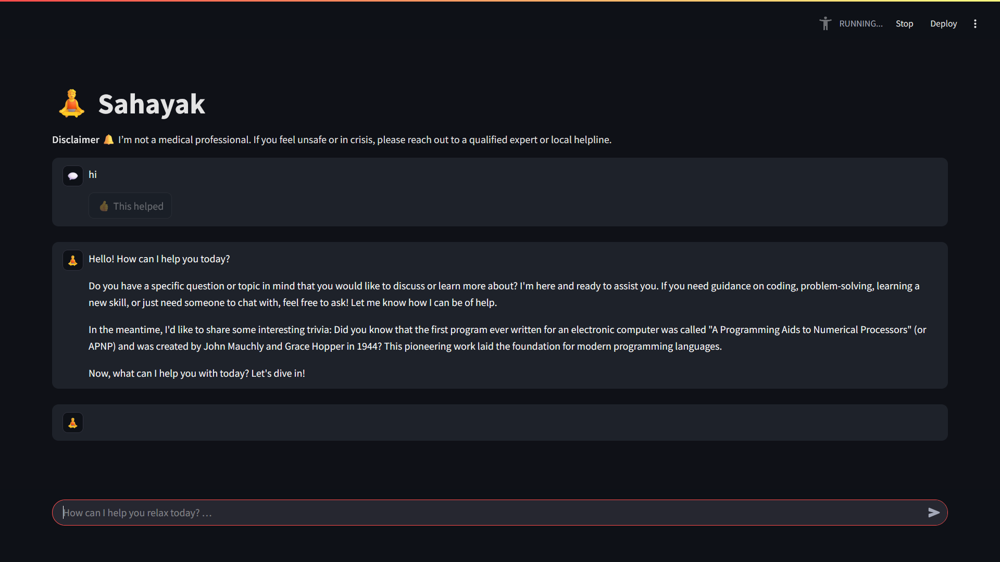
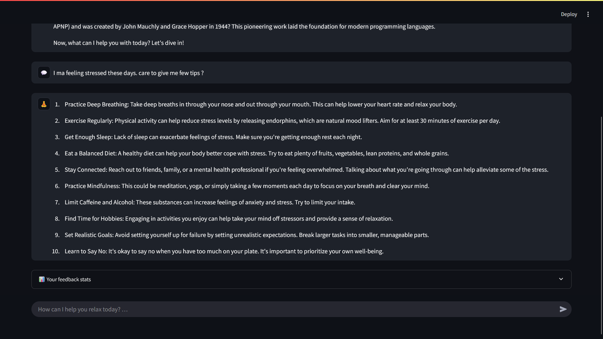

# Sahayak
# 🧘 Sahayak – Offline Mental‑Well‑Being Companion

A **local‑first chatbot** that offers bite‑sized coping exercises whenever you mention that you feel stressed or anxious.  Runs 100 % on your machine – zero cloud calls, full privacy.

---

## ✨ Key Features

|                          | Description                                                                                                                                             |
| ------------------------ | ------------------------------------------------------------------------------------------------------------------------------------------------------- |
| **Private‑by‑design**    | All language and embedding models run inside **Ollama**.  No data leaves your computer.                                                                 |
| **Context‑aware tips**   | Mentions of *stress*, *anxiety*, *overwhelm* trigger a retrieval pipeline that serves up tailored coping exercises from a CSV knowledge base.           |
| **Instant setup**        | One‑liner to pull models, one‑liner to run Streamlit.  No API keys required.                                                                            |
| **Easy to extend**       | Simply append more rows to `coping_exercises.csv` (title, description, duration) and delete `chroma_db/` – the vector store regenerates on next launch. |
| **Offline architecture** | Uses **LangChain → ChromaDB → Ollama** – everything containerised in a lightweight Python venv.                                                         |

---

## 📸 Demo

|                       Conversation view                       |                       Coping‑tips view                      |
| :-----------------------------------------------------------: | :---------------------------------------------------------: |
|  |  |

---

## 🏗️ Architecture

```text
coping_exercises.csv ─┐
                     │   Embeddings (Ollama / llama2‑7b‑embed)
                     ├──────────►  ChromaDB  ───►  RetrievalQA  ───►  Chat
User prompt ─────────┘                                         ▲   │
                                                             LangChain
```

---

## 🚀 Quick Start

```bash
# 1.  Install Ollama and pull the required models
ollama pull llama2-7b-chat
ollama pull llama2-7b-embed

# 2.  Set up Python environment
python -m venv venv && source venv/bin/activate  # PowerShell: venv\Scripts\Activate.ps1
pip install -r requirements.txt

# 3.  Run the Streamlit interface
streamlit run app.py
```

The app opens at [http://localhost:8501](http://localhost:8501).  Type *"I’m feeling stressed…"* and Sahayak will suggest exercises.

---

## ⚙️ Configuration

| Item                  | File                              | Default             |
| --------------------- | --------------------------------- | ------------------- |
| **Chat model**        | `config.py → DEFAULT_CHAT_MODEL`  | `"llama2-7b-chat"`  |
| **Embed model**       | `config.py → DEFAULT_EMBED_MODEL` | `"llama2-7b-embed"` |
| **Vector store path** | `config.py → CHROMA_DIR`          | `./chroma_db/`      |

Modify those constants and restart the app – no sidebar tweaking needed.

---

## 📂 Project Structure

```text
.
├── app.py                # Streamlit front‑end (dark theme, no sidebar)
├── vector_store.py       # Builds / loads persistent ChromaDB
├── data_utils.py         # Helpers to read coping_exercises.csv
├── config.py             # Centralised settings
├── coping_exercises.csv  # Knowledge base (add your own!)
├── requirements.txt      # Python deps
├── image.png             # Demo screenshot 1 (UI)
├── image2.png            # Demo screenshot 2 (tips)
└── README.md             # ← you are here
```

---

## 🛠️ Extending

1. **Add more exercises** – append rows to the CSV with columns:
   `title, description, duration`.
2. **Regenerate embeddings** – delete the `chroma_db/` directory before restart.
3. **Swap models** – pull a different model with Ollama (e.g. `mistral`) and update `config.py`.
4. **Deploy** – containerise with Docker or run behind a reverse proxy; Streamlit terms apply.

---

## 🙏 Disclaimer

Sahayak is *not* a substitute for professional mental‑health care.  If you feel unsafe or in crisis, please reach out to a qualified expert or local helpline.

---

## © License

MIT – do whatever you’d like, just don’t remove the original copyright notice.

---

## 🤝 Contributing

Pull requests welcome!  Please open an issue first to discuss major changes.

---

Made with ❤️  in India.
